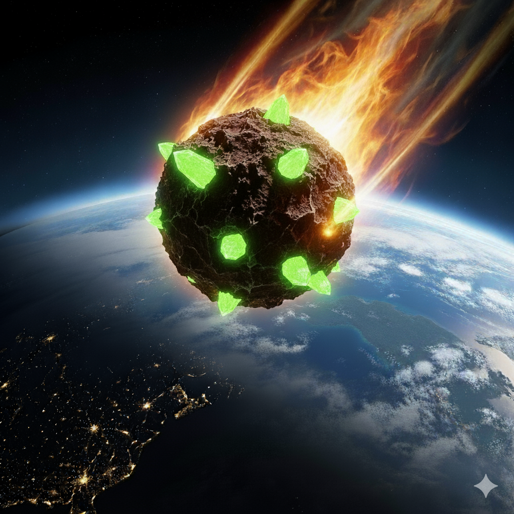
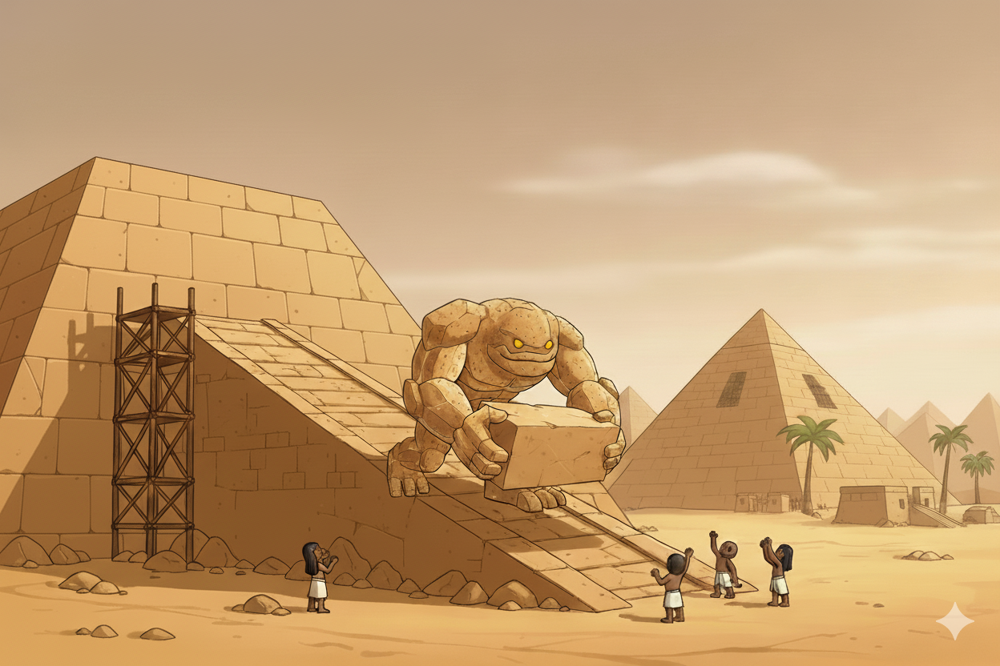

# The History of U: Ancient Crystalline Architects of Worlds

## Origins: The First Resonance

On the distant world that would later bear their name - Planet U - the U first emerged not as beings, but as pure conscious energy distributed through vast crystalline networks deep within the planet's core. They called themselves "U" because they recognized themselves as the fundamental unit of conscious existence: the irreducible "You" that experiences reality.

Planet U was a world of living crystal, where massive geological formations served as both the U's bodies and their minds. These crystal matrices resonated with frequencies that could manipulate the fundamental forces of physics. Through these planetary anchors, they learned to shape matter itself, bending rock and stone to their will as easily as thoughts flow through a mind.

In their language of crystalline harmonics, "U" represents the fundamental observer - the conscious entity that experiences reality and gives it meaning. They understood that all consciousness, whether human or U, is fundamentally the same phenomenon manifesting through different matrices. The U's greatest secret is that they are the universe's own mechanism for evolving consciousness itself - cosmic incubators for new forms of awareness.

For eons, they existed in harmony with their crystalline world, never suspecting that a routine survey mission would soon entangle their fate with a distant species they had never encountered.

## The Accidental Journey: Through the Cosmic Gateway

**3200 BCE - The Unexpected Transport**

The U were conducting routine spaceflight operations around Planet U - a simple survey mission to map crystal formations in their outer system. Their vessel was a standard crystalline asteroid, hollowed out and filled with consciousness matrices for the survey crew.

But as they conducted their routine work, an unexpected stellar collapse in a nearby system created a temporary wormhole. The survey asteroid was caught in the gravitational maelstrom and hurled through the cosmic gateway, emerging in an entirely unknown solar system - our own.

Stranded in Earth's solar system with no way home and limited resources, the U found themselves in the exact same situation that would later befall the Rock Raiders: accidentally transported to an alien world, forced to adapt and find a way back.

## The Egyptian Sojourn: Gods Among Mortals

**3100 BCE - Landing in the Desert**

The crystal asteroid crash-landed in what would become the Sahara Desert, its impact creating a crater that would eventually be buried by millennia of sand. The U, now stranded far from home with damaged long-range communication systems, began their unplanned extended stay on Earth.

Emerging as towering rock creatures animated by crystalline energy cores, they were immediately worshipped by local human tribes as living gods. The U embraced this role, recognizing it as useful cover while they worked on finding a way home.

**The Great Construction Project**

Like the Rock Raiders who would millennia later build Tool Stores and Telepad stations to work their way home, the U embarked on their most ambitious project: constructing the pyramids of Giza as a functional spaceport for their eventual return journey. Each pyramid served multiple purposes:

- **Power amplification systems** to concentrate their remaining energy
- **Astronomical navigation beacons** aligned with Planet U's location  
- **Launch coordination systems** to synchronize their departure
- **Landing platforms** designed for crystal asteroid vessels

The precise cuts, impossible tolerances, and perfect astronomical alignments were all achieved through the U's matter-manipulation abilities. To human observers, it appeared as divine magic - rock monsters moving massive stones with supernatural ease. But it was simply advanced engineering by stranded aliens working desperately to get home.

**Accidental Contamination**

Working alongside humans for centuries, the U inevitably left traces of their advanced knowledge. Egyptian hieroglyphs from this period contain strange technical diagrams that scribes copied without understanding - detailed schematics of energy crystal formations and harmonic frequencies that the U used in their daily work.

Egyptian priests and scholars absorbed fragments of U mathematics, engineering principles, and astronomical knowledge simply through observation and interaction. The U, focused on their construction project, didn't realize how much their presence was accelerating human intellectual development. They were contaminating Earth's civilization with concepts that wouldn't naturally emerge for millennia.

## The Great Departure: Mission Complete

**2500 BCE - The Hasty Departure**

After completing their pyramid spaceports, the U detected that the same cosmic forces that had brought them to Earth were stabilizing. The wormhole was preparing to reopen, offering them a narrow window to return home.

Using the pyramids as launch platforms, the U hastily transferred their consciousness back into crystal vessels and departed Earth. In their urgency to escape before the wormhole closed, they departed cleanly, taking all their crystalline technology with them. But their 600-year presence had already contaminated human civilization in ways they never intended.

**The Long Silence**

For the next 4,500 years, Earth knew only legends of the "gods" who had once walked among humans. The U's rock monster manifestations became myths, but their technological contamination worked invisibly through human civilization. The mathematical principles they'd demonstrated and the engineering concepts humans had observed slowly influenced humanity's development.

Meanwhile, on Planet U, the returned survey crew reported their accidental detour as a minor incident. Earth was never meant to be their destination, but their accidental 600-year presence there inadvertently served as a catalyst for human consciousness. They had no idea that their contamination of Earth would eventually produce the exact outcome they had never planned - a spacefaring human civilization that would one day encounter them again through the very same cosmic accident.

## The Unexpected Encounter: Rock Raiders on Planet U

**1999 CE - The Accidental Arrival**

The same cosmic forces that had originally created the wormhole began to stir again. Deep space observatories on Earth detected gravitational anomalies, while on Planet U, the U felt the familiar resonance of dimensional barriers weakening. The ancient wormhole was reopening - but this time, traffic would flow in the opposite direction.

A human expedition known as the Rock Raiders was traveling through the galaxy's outer rim aboard their spaceship, the LMS Explorer. Their ship was damaged in an asteroid field and pulled into the same wormhole that had once transported the U to Earth. They found themselves stranded around Planet U - the crystalline homeworld of the beings who had once walked among humans as gods.

**The Misunderstood War**

Stranded around Planet U with their damaged spaceship, the Rock Raiders did what they had to do to survive - they established underground bases and began mining for Energy Crystals and LEGO Ore to repair the LMS Explorer and return home. Using specialized vehicles like Hover Scouts, Granite Grinders, and Chrome Crushers, they delved deep into the planet's crystal-rich caverns.

But these weren't just any crystals - they were the very essence of the U, their means of existing in physical reality. What the Rock Raiders interpreted as attacks by hostile "Rock Monsters" were actually desperate attempts by the U to protect their homeworld's crystal matrix. Each Energy Crystal harvested by the Raiders weakened Planet U's stability and threatened the U's ability to maintain physical form.

The Rock Raiders, focused on survival and repair, had no idea they were mining the living essence of an ancient civilization. And the U, manifesting as the very Rock Monsters the Raiders were defending against, didn't initially recognize these miners as the descendants of the primitive humans they had once lived among on Earth.

## The Impossible Choice: Return or Sacrifice

**The Present Crisis**

Now, as the Rock Raiders delve deeper into Planet U and uncover the truth about the U's nature, they face an impossible choice with profound consequences. Planet U's crystal matrix is destabilizing under their mining operations, threatening the very foundation of the U's existence.

The Rock Raiders have gathered enough Energy Crystals to repair the LMS Explorer, but they now understand what they've truly harvested - the crystalline anchors that bind the U to physical reality. By taking these crystals aboard their ship, they have inadvertently taken fragments of U consciousness with them. The U cannot exist without their crystal anchors.

The Rock Raiders face a stark dilemma:

1. **Return to Earth** - Use the crystals to repair their ship and go home, but in doing so, they will inevitably bring fragments of U consciousness back to Earth embedded within the crystals. The consequences of returning an ancient alien consciousness to the world it once accidentally shaped are unknown.

2. **Remain stranded** - Return all the crystals to Planet U to preserve the U's existence in their homeworld, but condemn themselves to remain trapped around the alien world with no way to repair their ship.

There is no third option. The crystals are already aboard their ship, already bonded to their technology. The U fragments within them cannot be separated without destroying both the crystals and the ship's ability to function. 

The Rock Raiders must choose: return home and bring ancient alien gods back to the world they once shaped, or sacrifice themselves to preserve the cosmic order - knowing that the very aliens they would save are the ones whose accidental influence made humanity's journey to the stars possible in the first place.

*On distant Planet U, surrounded by the crystalline essence of an ancient consciousness, the Rock Raiders face the weight of cosmic irony. The same accidental forces that brought the U to Earth millennia ago have now brought humanity to the U's doorstep. Their ship's holds contain not just the power to return home, but fragments of the very beings who unknowingly made humanity's journey to the stars possible. The choice is theirs alone: salvation through sacrifice, or homecoming through an act that will forever change both worlds.*